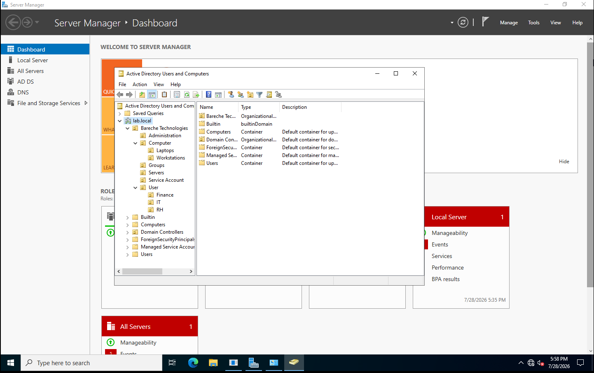
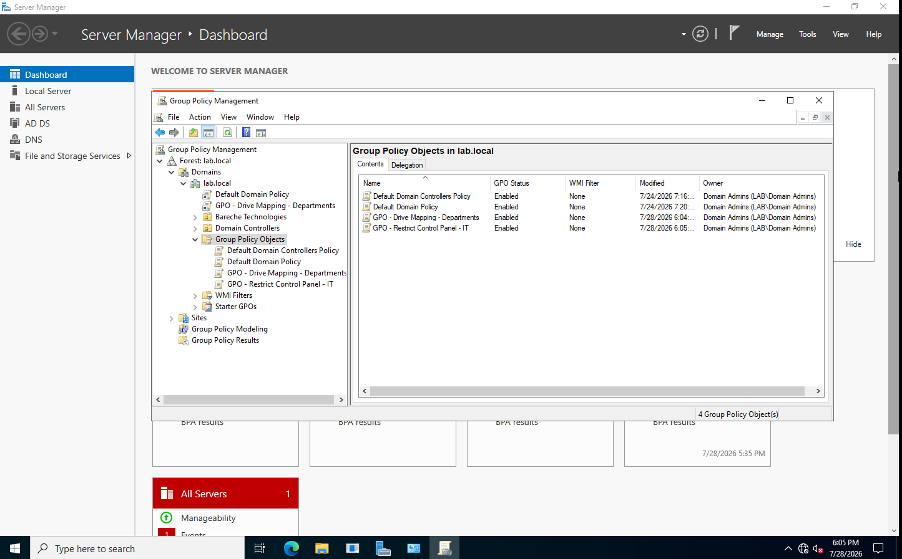
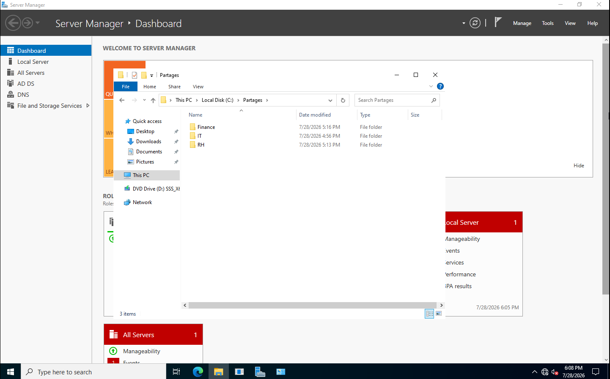
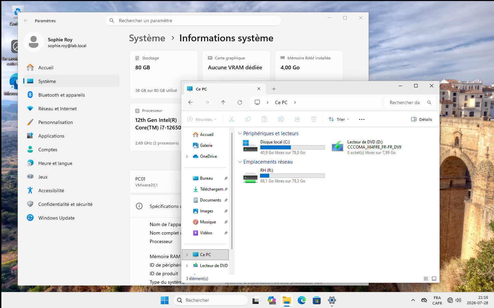
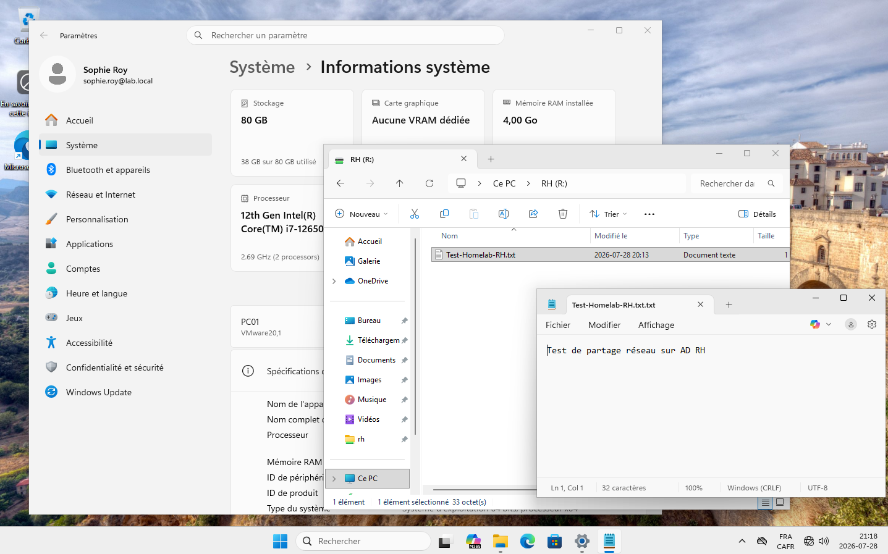

# Windows Server 2022 Enterprise HomeLab
# Windows Server 2022 Enterprise HomeLab

## Project Overview

This project simulates a small enterprise IT environment using Windows Server 2022 and Windows 11 running in VMware Workstation Pro.

The objective of this HomeLab is to gain practical experience with enterprise Windows administration by deploying and configuring Active Directory, DNS, Group Policy, File Services, NTFS permissions, and automated drive mapping.

---

# Lab Environment

## Screenshots

### Active Directory



---

### Group Policy



---

### File Server



---

### Automatic Drive Mapping



---

### Validation Test



## Virtualization

- VMware Workstation Pro

## Domain Controller

- Hostname: DC01
- Operating System: Windows Server 2022
- Roles Installed:
  - Active Directory Domain Services (AD DS)
  - DNS Server
  - File Server
  - Group Policy Management

## Client Computer

- Hostname: PC01
- Operating System: Windows 11 Pro
- Joined to the `lab.local` domain

---

# Active Directory

## Organizational Units

The Active Directory environment is organized into enterprise-style Organizational Units.

- IT
- Human Resources
- Finance
- Computers
  - Workstations
  - Laptops
- Servers
- Service Accounts
- Administration

---

## Security Groups

The following Global Security Groups were created.

- GG_IT
- GG_RH
- GG_FINANCE

These groups are used to assign permissions following Role-Based Access Control (RBAC) principles.

---

## Users

Test accounts were created for each department.

| User | Department |
|------|------------|
| Nadir Bareche | IT |
| Admin IT | IT |
| Sophie Roy | Human Resources |
| Mathis Tremblay | Finance |

---

# Group Policy

Two Group Policy Objects were implemented.

## Control Panel Restriction

A Group Policy was created to prevent selected users from accessing the Windows Control Panel.

## Automated Drive Mapping

Using Group Policy Preferences and Item-Level Targeting, network drives are automatically mapped according to Active Directory group membership.

| Department | Drive | Network Path |
|------------|------|--------------|
| IT | I: | \\DC01\IT |
| Human Resources | R: | \\DC01\RH |
| Finance | F: | \\DC01\Finance |

Each user automatically receives access only to the drive corresponding to their department.

---

# File Server

Shared folders were created on the domain controller.

```
C:\Shares
│
├── IT
├── RH
└── Finance
```

Share permissions and NTFS permissions are managed using Active Directory Security Groups.

Users receive **Modify** permissions instead of **Full Control**, following the Principle of Least Privilege.

---

# Validation Tests

The following tests were successfully completed.

✅ Domain Join completed successfully

✅ DNS name resolution between DC01 and PC01

✅ User authentication using domain accounts

✅ Active Directory logon

✅ Group Policy deployment

✅ Control Panel restriction applied successfully

✅ Automated network drive mapping

✅ Department-based access control

✅ Share permissions verified

✅ NTFS permissions verified

✅ Read, create, modify and save test files inside department shared folders

✅ ICMP communication successfully restored after Windows Firewall configuration

---

# Technologies Used

- Windows Server 2022
- Windows 11 Pro
- VMware Workstation Pro
- Active Directory Domain Services
- DNS
- Group Policy
- SMB File Sharing
- NTFS Permissions
- Windows Firewall
- Command Prompt
- PowerShell

---

# Skills Demonstrated

- Windows Server Administration
- Active Directory Administration
- Organizational Unit Design
- User & Group Management
- Group Policy Management
- File Server Deployment
- SMB Share Configuration
- NTFS Permission Management
- Role-Based Access Control (RBAC)
- Network Drive Automation
- DNS Configuration
- Windows Firewall Troubleshooting
- Technical Documentation

---

# Repository Structure

```
windows-server-2022-enterprise-homelab
│
├── README.md
├── LICENSE
├── docs
├── screenshots
├── diagrams
└── assets
```

---

# Future Improvements

The project will continue with additional enterprise features.

- DHCP Server
- Password Policies
- Account Lockout Policies
- Software Deployment using Group Policy
- BitLocker Management
- PowerShell Automation
- Windows Update Services
- Additional Client Machines
- Backup and Restore
- Network Segmentation
- Integration with future Cisco CCNA labs

---

# Author

**Nadir Bareche**

IT Support & Systems Administration learner building hands-on enterprise infrastructure projects to strengthen real-world system administration skills.
